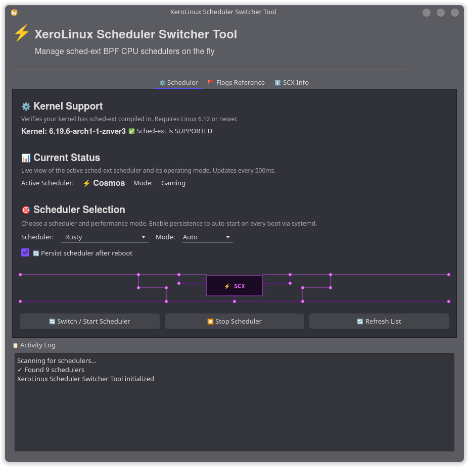

# Scheds and Kernel Manager (scx-tool)

A comprehensive GUI application for managing sched-ext CPU schedulers for **XeroLinux**.

## Features

### ⚡ Scheduler Switcher

- **Live Scheduler Switching**: Switch between sched-ext BPF CPU schedulers on the fly without rebooting
- **Real-time Monitoring**: Continuous status updates showing active scheduler and mode
- **Categorized Schedulers**: Organized by use case (Gaming, Desktop, Servers, Low Latency, Testing)
- **Persistence Support**: Enable schedulers to auto-start on boot via systemd service
- **Multiple Modes**: Support for auto, gaming, lowlatency, and powersave modes
- **Kernel Compatibility Check**: Automatic detection of sched-ext kernel support

### Managing Schedulers

1. Navigate to the **Scheduler Switcher** tab
2. Check kernel compatibility status
3. Select your desired scheduler from the dropdown
4. Choose a performance mode (auto, gaming, lowlatency, powersave)
5. Click **Switch/Start Scheduler** to activate
6. Enable **Persist scheduler after reboot** to auto-start on boot

### Scheduler Persistence

When you enable persistence:

- The application automatically creates a systemd service
- The service is configured with your selected scheduler and mode
- The scheduler will start automatically on boot
- You can disable persistence at any time to return to default EEVDF

The systemd service is dynamically updated whenever you enable persistence with a different scheduler or mode.

## Screenshots

### Contributing

Contributions are welcome! Please feel free to submit pull requests or open issues.

## Credits

- **Developer**: DarkXero
- **Project**: XeroLinux
- **Website**: https://xerolinux.xyz

## License

This project is licensed under the GPL-3.0 License - see the LICENSE file for details.

## Related Projects

- [scx-scheds](https://github.com/sched-ext/scx) - sched-ext BPF scheduler collection
- [scx-tools](https://github.com/sched-ext/scx) - Tools for managing sched-ext schedulers
- [XeroLinux](https://xerolinux.xyz) - Custom Arch Linux distribution

P.S : This tool is also embedded in the **XeroLinux Toolkit**. :D
